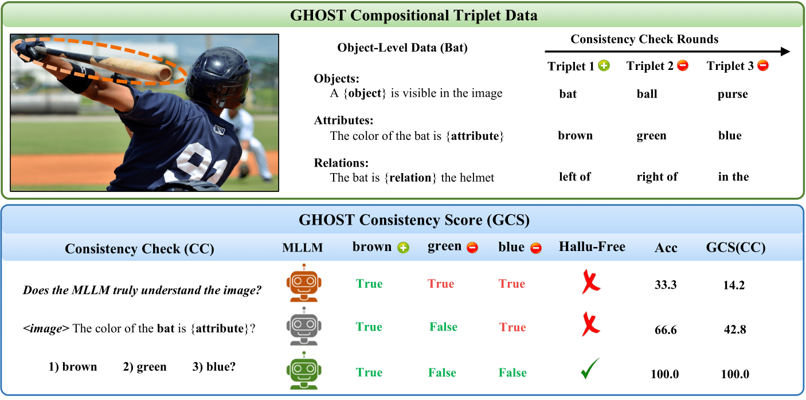

# GHOST: Getting to the Bottom of Hallucinations with a Multi-round Consistency Benchmark [WACV 2026]

[](https://pytorch.org/) 

[[`Project Page`](https://vibashan.github.io/ghost-web/)] [[`arXiv`]()] [[`PDF`]()] [[`Supplemental`]()] [[`Slides`]()]  [[`BibTeX`]()] 

<p align="center">
  
</p>


## Installation

```bash
pip install -r requirements.txt
```

For local VLM models, install [VLMEvalKit](https://github.com/open-compass/VLMEvalKit):
```bash
git clone https://github.com/open-compass/VLMEvalKit.git
cd VLMEvalKit && pip install -e .
```

## Quick Start

### Evaluate Predictions

```bash
python evaluate_ghost.py --pred-path predictions.json
```

### Generate Predictions

**Local VLM:**
```bash
python run_predictions.py \
  --data-path dataset/ghost_full_merged.json \
  --image-dir dataset/images/ \
  --model-name llava_v1.5_7b \
  --model-type vlm \
  --output-path predictions/llava_predictions.json
```

**API Model:**
```bash
python run_predictions.py \
  --data-path dataset/ghost_full_merged.json \
  --image-dir dataset/images/ \
  --model-name gpt-4o \
  --model-type api \
  --output-path predictions/gpt4o_predictions.json \
  --api-key YOUR_API_KEY
```

**Checkpoint/Resume:**
- Predictions are automatically saved every 10 questions
- If interrupted, rerun the same command to resume
- Use `--no-resume` to start from scratch
- Use `--checkpoint-every N` to change checkpoint frequency

## Dataset Format

JSON format with question keys: `{image_id}_{object_id}_{question_type}_{pos/neg}`

```json
{
  "2406158_obj3_1pos": "A wheels is present in the image.",
  "2406158_obj3_attr1_1pos": "The color of the wheels present in the image is white.",
  "2406158_obj3_rel1_1pos": "The spatial relation between the wheels and man is that the wheels is to the left of the man."
}
```

**Question Types:**
- Object: `1pos`, `1neg`, `2neg`, ...
- Attribute: `attr1_1pos`, `attr1_1neg`, ...
- Relation: `rel1_1pos`, `rel1_2neg`, ...

## GhostConsistencyScore Metric

The GCS uses exponential decay to penalize incorrect predictions:

```
For each object:
  GCS = 1 - (sum_i(num_incorrect) / sum_i(total_questions))

Where:
  sum_i(n) = 1 + 1/2 + 1/4 + 1/8 + ... (sum of 1/2^j for j=0 to n-1)
```

**Intuition:** First errors are weighted more heavily than later ones. If a model gets the first questions wrong, it fundamentally misunderstands the concept.

**Categories:**
- **Objects GCS**: Consistency on object presence questions
- **Attributes GCS**: Consistency on object attribute questions
- **Relations GCS**: Consistency on spatial relation questions

## Output Format

Predictions are saved as JSON:

```json
[
  {
    "question_id": "2406158_obj3_1pos",
    "object_id": "2406158_obj3",
    "image": "2406158.jpg",
    "text": "A wheels is present in the image.",
    "label": "yes",
    "model_name": "llava_v1.5_7b",
    "prediction": "true"
  }
]
```

## Repository Structure

```
ghost-evaluation/
├── dataset/
│   ├── ghost_full_merged.json
│   └── images/
├── ghost_consistency_score.py
├── utils.py
├── evaluate_ghost.py
├── run_predictions.py
├── requirements.txt
├── .gitignore
└── README.md
```

## Library Usage

```python
from evaluate_ghost import evaluate

results = evaluate('predictions.json')
print(f"Objects GCS: {results['objects_gcs']:.2f}%")
print(f"Attributes GCS: {results['attributes_gcs']:.2f}%")
print(f"Relations GCS: {results['relations_gcs']:.2f}%")
```

## API Implementation

To use API models, implement the `get_api_prediction()` function in `run_predictions.py`:

```python
def get_api_prediction(model_name: str, image_path: str, prompt: str, api_key: str = None) -> str:
    if model_name == 'gpt-4o':
        # Implement OpenAI API call
        pass
    elif model_name == 'gemini-pro':
        # Implement Google Gemini API call
        pass
    # Add more models as needed
```

## Citation

```bibtex
@article{ghost2024,
  title={GHOST: Evaluating Vision-Language Models on Compositional Understanding},
  author={[Authors]},
  journal={[Journal/Conference]},
  year={2024}
}
```

## License

[Specify your license]

